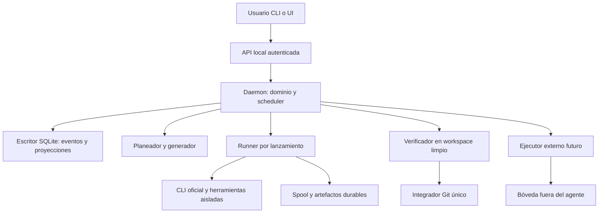

# Arquitectura y proyectos

## Estructura propuesta

Monolito modular TypeScript sobre una versión patch certificada de Node 24, distribuido inicialmente por npm. Un paquete publicable con módulos de dominio, almacenamiento, proveedores, runtime, planificación, verificación, CLI y, posteriormente, web. Extraer paquetes sólo si surge una interfaz reutilizable o ciclo de publicación independiente.

Los workers no reciben acceso a la API administrativa, estado, registro, bóveda, otras tareas ni sockets del host. Reciben el contrato de su tarea, un workspace y un canal restringido de preguntas/resultados. La separación en procesos sin controles del SO no basta para imponer esta frontera.

## Tecnología y responsabilidades

| Área | Elección propuesta | Condición |
|---|---|---|
| Estado | SQLite WAL y eventos + proyecciones en la misma transacción | Disco local; único escritor por DB; FK activas; durabilidad FULL para estado crítico |
| Acceso a DB | `node:sqlite` encapsulado, escritor en hilo dedicado | Validar API y backups en Node certificado; no bloquear la API con indexación |
| Esquemas | Zod y exportación JSON Schema | Probar subconjunto que cada proveedor acepta; validación local sigue siendo autoritativa |
| API/web | Hono, HTML de servidor, htmx y SSE | UI en M4; contenido de modelos escapado y sin HTML arbitrario |
| Git | Git del sistema a través de argumentos estructurados | Sin interpolar comandos del modelo; único integrador autorizado |
| Tests Forja | Vitest para núcleo y fixtures; integración con Git/procesos reales | Sin modelos pagados en CI ordinaria |
| Memoria | IDs y búsqueda textual inicialmente; SQLite y Tree-sitter después | Datos reconstruibles, con revisión y procedencia |
| Aislamiento | Backend Linux certificado en M0 | Mecanismo del SO que cubra procesos, archivos y red; fallo cerrado |

No se promete compatibilidad de `node:sqlite` con un binario Bun. Empaquetado alternativo requiere otra certificación. La elección Node procede del contexto del autor y de la propuesta v1, no de una prueba de que otros lenguajes sean peores.

## Fuentes de verdad y disposición

En el repo: `forja.yaml`, `.forja/spec.json`, planes, tareas, decisiones, lecciones revisadas, documentos generados y manifiestos de pruebas. Son decisiones versionables, sin sesiones ni secretos.

Fuera del repo, en un directorio privado de Forja por usuario: registro global y, por `checkout_id`, `estado.db`, artefactos por hash, spool de runners, worktrees privados, copias y logs redactados. Índices de memoria se pueden borrar y reconstruir. La bóveda futura tiene respaldo independiente.

Los archivos originales de este análisis son documentación de diseño; las rutas anteriores describen el producto futuro y no se crean en esta entrega.

Git conserva intención y código; SQLite conserva la historia operativa. **El historial de ejecución no se reconstruye sólo desde Git.** Auditoría JSONL será una exportación de eventos, evitando dos escrituras pretendidamente atómicas.

## Identidad y concurrencia

- `project_id`: lógico y versionado. `checkout_id`: local y no versionado. Ruta normalizada e identidad del repositorio detectan enlaces y alias.
- Importar otro clon no mueve automáticamente el anterior. Vincular exige identificar un traslado real; si existen ambos, se registran dos checkouts.
- Un daemon por usuario/directorio de datos, no por toda la máquina. Bloqueo del SO evita dos dueños; PID es diagnóstico, no exclusión suficiente.
- Un escritor e integrador por checkout. Runs simultáneos en un mismo checkout quedan serializados en el MVP; otros proyectos pueden estar en cola.
- Límites globales por máquina y cuenta de proveedor, más cuotas por proyecto. Las tareas largas no monopolizan todos los cupos; orden estable por prioridad y antigüedad.

## Importación y confianza

Importar sólo inspecciona archivos y manifiestos. No ejecuta scripts de instalación, hooks, MCP ni comandos detectados. Detecta repos sucios, submódulos, LFS, enlaces simbólicos y tamaño; capacidades no soportadas bloquean ejecución con diagnóstico.

Un repo sin commits necesita una base explícita antes de worktrees. Si hay cambios del usuario sin commit, se informa y se pide resolverlos o seleccionar una base existente; Forja no los incluye ni descarta silenciosamente. El baseline dinámico usa el entorno aislado y el perfil de comandos aprobado.

## Persistencia operativa

Retención inicial propuesta: logs 14 días, artefactos mientras el run siga abierto, 7 copias diarias. Límites configurables y aviso antes de quedarse sin espacio. Limpieza sólo de datos cerrados, con vista previa; ningún borrado automático de workspaces con cambios no exportados. SQLite sobre NFS o carpetas sincronizadas no forma parte del soporte.

Migraciones de DB versionadas: parada de nuevas tareas, backup, migración transaccional donde sea posible, comprobación de integridad y arranque. Una versión antigua rechaza una DB nueva. No se modifica destructivamente el registro original de eventos para actualizar su esquema.
